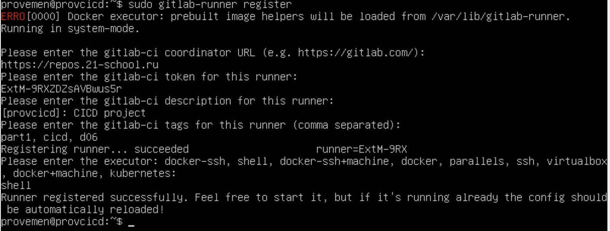

### Part 1. Настройка **gitlab-runner**

**== Задание ==**

##### Поднять виртуальную машину *Ubuntu Server 20.04 LTS*
*Будьте готовы, что в конце проекта нужно будет сохранить дамп образа виртуальной машины*

##### Скачать и установить на виртуальную машину **gitlab-runner**

- sudo apt install gitlab-runner

##### Запустить **gitlab-runner** и зарегистрировать его для использования в текущем проекте (*DO6_CICD*)

- sudo gitlab-runner register

- далее вводим URL, токен, описание и теги(скрин ниже)

### Part 2. Сборка

**== Задание ==**

#### Написать этап для **CI** по сборке приложений из проекта *C2_SimpleBashScripts*:

##### В файле _gitlab-ci.yml_ добавить этап запуска сборки через мейк файл из проекта _C2_

##### Файлы, полученные после сборки (артефакты), сохранять в произвольную директорию со сроком хранения 30 дней.
